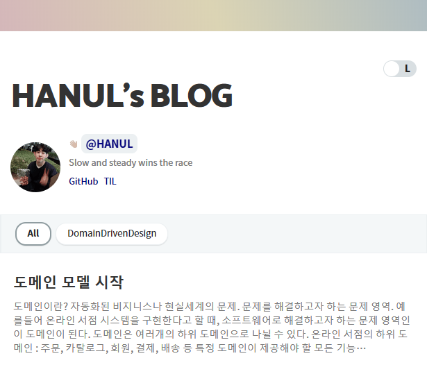

# HANUL LOG

 

이 저장소는 [Gatsby](https://www.gatsbyjs.org/) 정적 사이트 생성기와 [gatsby-starter-bee](https://github.com/JaeYeopHan/gatsby-starter-bee) template을 기반으로 만들어졌으며, [netlify](https://www.netlify.com/) 를 이용하여 배포되었습니다.

### 배우고 느낀 모든 것을 기록합니다.
### "Slow ans steady wins the race"
