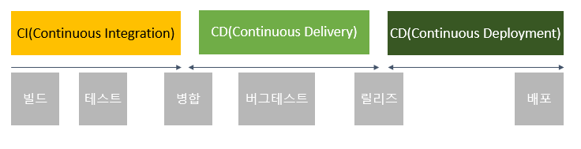

## DevOps란?

DevOps란 개발(Development) + 운영(Operations)

- 개발 조직과 운영 조직 사이의 소통, 협업, 융합을 강화하는 개발 환경이나 문화를 말한다. 

 
## 왜 DevOps가 생기게 되었나?

소프트웨어는 개발부터 고객에게 배포될 때까지 개발, 테스트, 인프라 등 다양한 과정을 거치게 된다.

다양한 과정을 거치는 만큼 회사가 조금만 커져도 자연스럽게 각 단계를 진행하는데 반복적이고, 불필요한 작업과 오버헤드가 생기게 된다. 

결과적으로 배포 주기가 길어지고, 배포되는 변경 사항이 커지기 때문에 배포의 위험이 증가하게 된다. 또한, 고객에게 새로운 소프트웨어가 전달되기까지 오랜 시간이 걸리게 됩니다.

이러한 문제를 해결하기 위해 나온 개념이 DevOps이다.

## 장점

운영과 개발에 경계가 줄어듬으로 작업 속도가 빨라진다. 다시말해, 새로운 기능의 릴리스와 버그 수정 속도가 빨라지므로 고객의 요구에 더 빠르게 대응할 수 있다.

- 빠른 고객 혁신 가능

## 어떻게 DevOps를 실천할까? 

서버 구성, 배포, 테스트 등의 반복적이고 단순한 작업을 최대한 자동화해서 배포에 들어가는 비용을 최대한으로 줄이는 것부터 시작된다.

배포가 쉬워지면 작은 단위로도 배포를 여러 번 할 수 있게 되고, 결국 큰 장애가 발생하기 전에 문제를 바로 발견해서 해결할 수 있고 서비스를 민첩하게 운영할 수 있는 결과를 가져온다.

=> CI/CD

## CI/CD란?
- 애플리케이션 개발 단계를 자동화하여 짧은 주기로 고객에게 제공하는 방법을 말한다.
- 애플리케이션의 라이프사이클 전체에 걸쳐 지속적인 자동화와 지속적인 모니터링을 제공한다.
- 지속적인 통합(Continuous Integration), 지속적인 서비스 제공(Continuous Delivery), 지속적인 배포(Continuous Deployment)으로 구성

### 1.  CI : 지속적 통합(Continuous Integration)
- 개발을 하면서 지속적으로 코드에 대한 통합을 진행함으로써 품질을 유지하자는 것을 말한다.
- 정기적인 빌드 및 테스트(유닛테스트 및 통합테스트)를 거쳐 공유 레포지토리에 병합
- 기존 코드와 신규 코드 간의 충돌 발생시, 버그를 빠르게 수정 가능

### 2. CD: 지속적인 서비스제공( Continuous Delivery)
- CI 프로세스를 통해 개발중에 지속적으로 빌드와 유닛 및 통합 테스트를 진행하고, 이를 통과한 코드에 대하여 테스트 서버와 운영 서버에 자동으로 릴리즈
- 운영팀이 보다 빠르고 손쉽게 배포 가능
- 프로덕션 환경으로 배포할 준비가 되어 있는 코드 베이스를 확보하는 것이 목표

### 3. CD : 지속적인 배포( Continuous Deployment)
- 프로덕션 준비가 완료된 빌드를 코드 리포지토리에 자동으로 릴리스
- 애플리케이션을 프로덕션으로 릴리스하는 작업을 자동화
- Continuous Delivery로 통칭하여 언급하기도 함
- 테스트와 빌드가 '지속적'으로 이루어지기 때문에, 배포 또한 '지속적'으로 이루어진다

## CI/CD 장단점
- 사용자 피드백을 지속적으로 수신하고 통합하는 일이 훨씬 수월해지게 한다. 
- 배포의 위험성을 줄여주므로 변경 사항을 작은 조각으로 세분화해서 손쉽게 릴리스할 수 있다. 
- 자동화된 테스트는 CI/CD 파이프라인의 여러 테스트 및 릴리스 단계를 수행할 수 있어야 하기 때문에 많은 선행 투자가 필요하다.