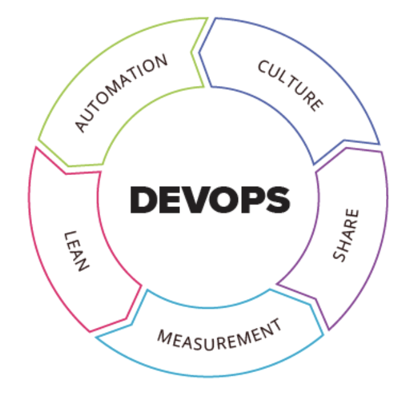

## DevOps란?
DevOps란 개발(Development) + 운영(Operations)의 합성어로 비즈니스 조직과 IT조직 사이의 소통, 협업, 융합을 강화하는 개발 환경이나 문화를 말한다.
다시 말해, 고객과 업무를 가장 잘 이해하는 비즈니스 조직원과 IT조직원의 목적을 일치시키고 IT서비스로 구현하며 계속 발전되는 '문화'를 만들자는 것이다.
따라서 고객과 비즈니스를 위한 지속적인 혁신이 가능하다.

### DevOps는 CALMS MODEL의 원칙을 따른다.

## CI/CD란?
- 애플리케이션 개발 단계를 자동화하여 짧은 주기로 고객에게 제공하는 방법을 말한다.
- 애플리케이션의 라이프사이클 전체에 걸쳐 지속적인 자동화와 지속적인 모니터링을 제공한다.
- 지속적인 통합(Continuous Integration), 지속적인 서비스 제공(Continuous Delivery), 지속적인 배포(Continuous Deployment)으로 구성

### 1.  CI : 지속적 통합(Continuous Integration)
- 개발을 하면서 지속적으로 코드에 대한 통합을 진행함으로써 품질을 유지하자는 것을 말한다.
- 정기적인 빌드 및 테스트(유닛테스트 및 통합테스트)를 거쳐 공유 레포지토리에 병합
- 기존 코드와 신규 코드 간의 충돌 발생시, 버그를 빠르게 수정 가능

### 2. CD: 지속적인 서비스제공( Continuous Delivery)
- CI 프로세스를 통해 개발중에 지속적으로 빌드와 유닛 및 통합 테스트를 진행하고, 이를 통과한 코드에 대하여 테스트 서버와 운영 서버에 자동으로 릴리즈
- 운영팀이 보다 빠르고 손쉽게 배포 가능
- 프로덕션 환경으로 배포할 준비가 되어 있는 코드 베이스를 확보하는 것이 목표

### 3. CD : 지속적인 배포( Continuous Deployment)
- 프로덕션 준비가 완료된 빌드를 코드 리포지토리에 자동으로 릴리스
- 애플리케이션을 프로덕션으로 릴리스하는 작업을 자동화
- Continuous Delivery로 통칭하여 언급하기도 함
- 테스트와 빌드가 '지속적'으로 이루어지기 때문에, 배포 또한 '지속적'으로 이루어진다

## CI/CD 장단점
- 사용자 피드백을 지속적으로 수신하고 통합하는 일이 훨씬 수월해지게 한다. 
- 배포의 위험성을 줄여주므로 변경 사항을 작은 조각으로 세분화해서 손쉽게 릴리스할 수 있다. 
- 자동화된 테스트는 CI/CD 파이프라인의 여러 테스트 및 릴리스 단계를 수행할 수 있어야 하기 때문에 많은 선행 투자가 필요하다.
