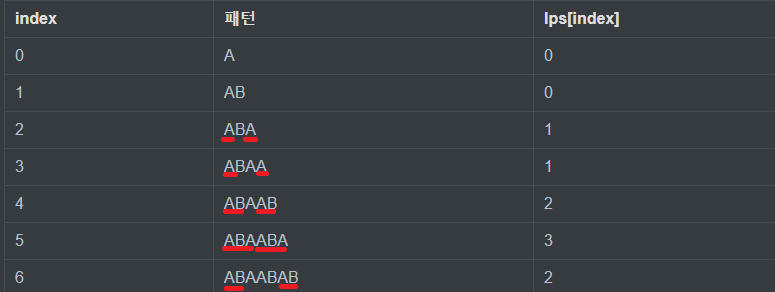
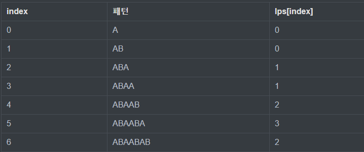
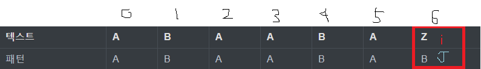

## KMP 개념
문자열A = {"ABABABABC"}에서 문자열B = {"ABABC"} 를 찾는 방법을 생각해보자.

가장 먼저 생각나는 방법은 `브루트포스`로 모든 경우를 탐색하는 방법이다. 이 경우에는 O(문자열A 길이(n) * 문자열B 길이(m))의 시간 복잡도를 갖게된다.

만약 n, m이 10만 이상인 문제가 주어진다면 시간 초과가 발생할 것이다.


이 문제를 O(N+M)의 시간 복잡도만으로 해결할 수 있는데, 이 방법이 `KMP`이다.

KMP는 만든 사람의 이름인 Knuth, Morris, Prett 세 사람의 앞 글자를 따서 KMP(Knuth–Morris–Pratt Algorithm)이라고 불린다.

KMP는 어떻게 탐색을 할까?

텍스트 "ABABABABC" 에서 패턴 "ABABC" 를 찾는 경우를 보자.


인덱스 4번째에서 불일치가 발생한다. 그리고 알 수 있는 점은 3번째 인덱스까지는 일치하고, 파랑색 박스로 표시한 부분의 패턴이 일치하는 것을 알 수 있다. 이러한 경우 인덱스2번째 B를 건너 뛸 수 있다.


어떻게 현재 비교중인 문자열에서 K번째 문자까지 같다는 점을 이용하여 비교를 건너 뛸 수 있을까?

KMP에서는 문자열을 비교하다가 찾는 문자열과 다르다는걸 알게 되었을 때 lps(longest proper prefix which is also suffix)라는 값을 참고하여 다음 비교 위치를 정해준다. 그러면 lps는 어떻게 정의되고 어떻게 참고하여 어떻게 건너뛸까?



위의 사진을 보면 알 수 있듯이 lps는 0번째~n번째 위치까지 볼 때 접두사(prefix)==접미사(suffix)가 되는 최대 접두사(or 접미사) 길이이다.


어떻게 활용되는지 예제를 하나 더 보자. ex) 텍스트 "ABAABAZABAABAB" ,  패턴 "ABAABAB"





5번째 인덱스까지 일치하고 6번째 인덱스부터 다르다. 이때 lps[5] = 3 이고, 패턴의 인덱스 3번부터 비교하면 된다는 뜻이다. 즉 문자열의 i번째 인덱스랑 패턴의 3번째 인덱스부터 다시 탐색을 시작하는 것이다.


## KMP 구현

```java
  public static int[] calculate_lps(String pattern_str) {
    int pattern_len = pattern_str.length();
    int[] lps = new int[pattern_len];
    int j = 0;
    for(int i=1; i<pattern_len; i++) {
      while (j>0 && pattern_str.charAt(i) != pattern_str.charAt(j)) {
        j = lps[j-1];
      }
      if (pattern_str.charAt(i) == pattern_str.charAt(j)) {
        j++;
        lps[i] = j;
      }
    }
    return lps;
  }

  public static void kmp(String target_str, String pattern_str, int[] lpsArray) {
    int target_len = target_str.length();
    int pattern_len = pattern_str.length();
    int j = 0;
    for(int i=0; i<target_len; i++) {
      while(j>0 && target_str.charAt(i) != pattern_str.charAt(j)) {
        j = lpsArray[j-1];
      }

      if (target_str.charAt(i) == pattern_str.charAt(j)) {
        if(j==pattern_len-1) {
          System.out.println("Found 위치 : " + (i-pattern_len+1));
          j=lpsArray[j];
        }
        else {
          j++;
        }
      }
    }
  }
```

```java
  public static void main(String[] args) {
    String target_str = "ABABABABBABABABABCABABABABC";
    String pattern_str = "ABABABC";

    int target_len = target_str.length();
    int pattern_len = pattern_str.length();
    int[] lpsArray = calculate_lps(pattern_str);
    StringBuilder sb = new StringBuilder();
    sb.append("[");
    for(int i=0; i<lpsArray.length; i++) {
      sb.append(lpsArray[i]);
      if (i!=lpsArray.length-1) {
        sb.append(",");
      }
    }
    sb.append("]");
    System.out.println("lpsArray : "+ sb.toString());
    kmp(target_str, pattern_str, lpsArray);
  }
```

```
lpsArray : [0,0,1,2,3,4,0]
Found 위치 : 11
Found 위치 : 20
```


## 참고 자료
- [라이](https://blog.naver.com/kks227/220917078260)
- [kyungkoo jun youtube](https://www.youtube.com/watch?v=KXolmVUpUQQ)
- [bowbowbow](https://bowbowbow.tistory.com/6)
