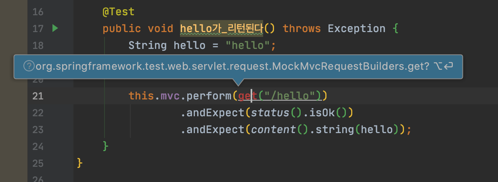

static method의 import 자동완성을 할 때 분명 존재하는 라이브러리지만, 원하는 것이 목록에 없는 경우가 있다. 

이러한 오류는 사용할 method로 매치되는 항목이 너무 많을 경우 발생한다고 한다.

### 해결 방법
`settings > General > Auto Import` 에 들어가서 

`Exclude from import and completion` 에 쓰지않는 패키지들을 추가.

### 추가한 목록
- com.sun
- javax.swing
- jdk.internal
- jdk.nashorn
- oracle.jrockit
- org.graalvm
- sun.jvm
- sun.security
- sun.swing
