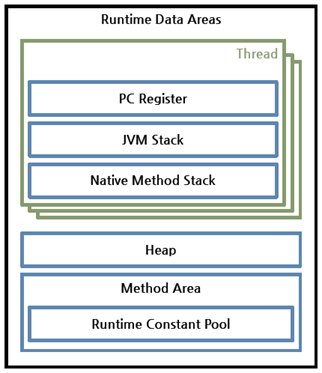

## Java Virtual Machine (JVM)
JVM이란, 자바 가상 머신의 약자를 줄여 부르는 용어이다.

자바 프로그램에서는 이 JVM을 사용하여 프로그램을 돌린다. 왜 그럴까??
일반적인 프로그램은 Windows또는 Linux같은 OS 위에서 실행된다. 하지만 자바 프로그램 같은 경우에는 OS 위의 JVM에서 실행이된다. 이렇게 JVM위에서 굳이 자바 프로그램을 돌리는 이유는 자바 프로그램을 OS에 상관없이 실행시키기 위함이다.
예를들어 Windows에서 동작하도록 구현된 워드 프로그램은 Linux에서 동작하지 않는다. 이 워드 프로그램을 Mac환경에서 돌리기 위해서는 Mac기반으로 다시 구현해야 한다. 하지만 자바 프로그램 같은 경우 어떤 OS 에서도 그에 맞는 JVM 다운로드를 통해 자바 프로그램을 실행 실킬 수 있다.

### JVM 역할
- 자바 애플리케이션을 클래스 로더를 통해 읽어 들여 자바 API와 함께 실행하는 것이다.
- JVM은 자바와 OS사이에서 중개자 역할을 수행하여 OS에 독립적인 플랫폼을 갖게 해준다. 즉 OS 의 메모리 영역에 직접적으로 접근하지 않고 JVM 이라는 가상 머신을 이용해서 간접적으로 접근한다.
- JVM은 프로그램의 메모리 관리를 알아서 해준다. C프로그램 같은 경우에는 직접 메모리 할당을 해주고 해지해줘야한다. 하지만 자바에서는 JVM이 자동으로 메모리 관리를 해주는 장점이 있다.

### 자바 프로그램 실행 과정
1. 프로그램이 실행되면 JVM은 OS로부터 이 프로그램이 필요로 하는 메모리를 할당받는다. JVM은 이 메모리를 용도에 맞게 여러 영역으로 나누어 관리한다.
2. 자바 컴파일러(javac)가 자바 소스코드(.java)를 읽어들여 자바 바이트코드(.class)로 변환시킨다.
3. 클래스 로더를 통해 class 파일들을 JVM으로 로딩한다.
4. 로딩된 class 파일들은 Execution engine을 통해 해석된다.
5. 해석된 바이트코드(.class)는 Runtime Data Areas에 배치되고 수행이 이루어지게 된다. 이러한 과정속에서 JVM은 필요에 따라 GC 같은 관리 작업을 수행한다.

### Java Compiler
자바 소스(.java)코드를 Byte code(.class)로 변환하는 역할을 한다.

### Class Loader
자바 바이트 코드를 읽어서 JVM의 Execution Engine이 사용할 수 있도록 Runtime Data Area에 적재하는 역할을 한다.

### Execution Engine(실행 엔진)
클래스를 실행시키는 역할을 한다. 실행 엔진은 바이트 코드를 실제로 JVM내부에서 기계가 실행할 수 있는 형태로 변경한다. 이 때 두 가지 방식을 사용한다.
- Interpreter

  명령어를 그때그때 해석해서 실행하게 되어 있다.

- JIT(Just-In-Time)

  인터프리터의 단점을 보완하기 위해 도입된 컴파일러이다. 인터프리터 방식으로 실행하다가 적절한 시점에서 바이트코드 전체를 컴파일하여 네이티브 코드로 변경하고, 이후에는 더 이상 인터프리팅 하지 않고 네이티브 코드로 직접 실행하는 방식이다. 네이티브 코드는 캐시에 보관하기 때문에 한 번 컴파일된 코드는 빠르게 수행하게 된다.

### Runtime Data Areas
런타임 데이터 영역은 프로그램을 수행하기 위해 OS에서 할당받는 메모리 영역이다. 런타임 데이터 영역은 5개의 영역으로 나눌 수 있다. 이중 PC 레지스터(PC Register), JVM 스택(JVM Stack), 네이티브 메서드 스택(Native Method Stack)은 스레드마다 하나씩 생성되며 힙(Heap), 메서드 영역(Method Area) 은 모든 스레드가 공유해서 사용한다.

### PC Register
스레드가 시작될 때 생성된다. PC레지스터는 Thread가 어떤 명령어로 실행되어야 할지에 대한 기록을 하는 부분으로 현재 수행중인 JVM명령의 주소를 갖는다.

### Stack Area
프로그램 실행과정에서 임시로 할당되었다가 메소드를 빠져나가면 바로 소멸되는 특성의 데이터를 저장하기 위한 영역이다. 지역변수, 매개변수, 메소드 정보, 연산 중 발생하는 임시 데이터등 저장이 된다. 메소드 호출 시마다 각각의 스택 프레임(그 메소드만을 위한 공간)이 생성된다. 메서드 수행이 끝나면 프레임 별로 삭제한다.

### Native method stack
일반적으로 JVM은 네이티브 방식을 지원한다. 따라서 스레드에서 네이티브 방식의 메소드가 실행되는 경우 Native Method Stack에 쌓인다. 일반적인 메소드를 실행하는 경우 JVM 스택에 쌓이다가 해당 메소드 내부에 네이티브 방식을 사용하는 메소드(예를 들면 C언어로 작성된 메소드)가 있다면 해당 메소드는 네이티브 스택에 쌓인다.

### Heap Area
동적으로 할당되는 데이터가 저장되는 영역이다. 예를들어 객체생, 배열등이 생성되었을 때 저장되는 공간이다. Heap에 할당된 데이터는 GC의 대상입니다. JVM 성능 등의 이슈에서 가장 많이 언급되는 공간이다.

### Method Area(Class Area, Code Area, Static Area)
메서드 영역은 모든 스레드가 공유하는 영역으로 JVM이 시작될 때 생성된다. JVM이 읽어 들인 각각의 클래스와 인터페이스에 대한 런타임 상수 풀, 필드와 메서드 코드, Static 변수, 메서드의 바이트코드 등을 보관한다.

### Runtime constant pool
Method area 내부에 존재하는 영역으로, 각 클래스와 인터페이스의 상수뿐만 아니라, 메서드와 필드에 대한 모든 레퍼런스까지 담고 있는 테이블이다. 즉, 상수 자료형을 저장하여 참조하고 중복을 막는 역할을 수행한다.

### 참조
> [YABOONG](https://yaboong.github.io/java/2018/06/09/java-garbage-collection/)

> [Jbee](https://asfirstalways.tistory.com/158)

> [minwan](https://minwan1.github.io/2018/06/06/2018-06-06-Java,JVM/)
