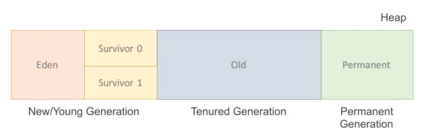

JVM이 메모리를 관리하는 방법인 Garbage Collector와 Mark & Sweep 에 대해 설명하도록 한다. 이에 앞서 JVM의 메모리 관리방법을 알기 위해서는 JVM이 무엇인지에 대해 먼저 알아야한다. [JVM이란 무엇인가?](https://hanul-dev.netlify.com/java/%EC%9E%90%EB%B0%94%EA%B0%80%EB%A8%B8%EC%8B%A0(jvm)%EC%9D%B4%EB%9E%80-%EB%AC%B4%EC%97%87%EC%9D%B8%EA%B0%80/)

## 가비지란?
다음 코드를 보고 여기서 말하는 `가비지`가 무엇인지 생각해보자.

```java
String temp = "AAA";
temp += "BBB";
```

위의 코드에서 더하기 연산을 수행하면 기존에 할당받은 AAA 에서 덧붙이는 것이 아니라, 더하기 연산이 수행 후 "AAABBB" 문자열이 새롭게 heap 영역에 할당되고 temp 변수는 새로운 문자열을 레퍼런스 하게된다. 따라서 이전에 할당받았던 공간은 더이상 참조되지 않게 되고 Unreachable Object가 된다. 이처럼 주소를 잃어버려서 도달 불가능한(Unreachable) 오브젝트들을 `가비지`라 한다.

## 가비지 컬렉터(GC)
가비지를 탐지하여 자동으로 해제 및 다시 사용할 수 있도록 하는 것(Memory Reclamation)이다.

JVM이 할당된 모든 메모리를 가지고 있고, 이를 관리한다는 뜻이다. JVM 실행시에 JVM 프로그램 내부에서 Stack과 Heap이라는 메모리 공간이 생성(초기화)된다. 메서드는 Stack에서 실행된다, 따라서 로컬 변수들은 Stack에 생성되고, 자바의 오브젝트와 클래스들은 Heap 공간에 할당된다. 가비지 컬렉터는 우리가 input으로 준 클래스파일을 실행하는 도중에 실행되며 Heap공간에서 더이상 참조(reference)되지 않는 메모리 공간(가비지)을 수거한다.


## 가비지 컬렉터의 과정
1. 가비지 컬렉터가 Stack의 모든 변수를 스캔하면서 각각 어떤 객체를 참조하고 있는지 찾아서 마킹한다.
2. Reachable Object가 참조하고 있는 객체도 찾아서 마킹한다.
3. 마킹되지 않은 객체를 Heap에서 제거한다.
첫번째와 두번째 과정은 객체를 찾아 마킹하는 과정이라하여 `Mark`라 하고, 세번째 과정은 객체를 쓸어내린다고하여 `Sweep`이라고 한다. 그래서 가비지 컬렉터의 과정을 `Mark and Sweep`이라고도 한다.



## New/ Young 영역
- Eden : 객체들이 최초로 생성되는 공간.
- Survivor 0 : Eden 영역이 꽉 찼을 때 Mark and Sweep 과정이 일어나게 되고 그중에서 살아남은 객체가 저장되는 공간. 빈 공간이 없을 때 까지 반복 수행된다.
- Survivor 1 : Survivor 0 영역에서 살아남은 객체들이 이동하여 저장되는 공간. 이동한 객체는 Age 값 증가.

여기서 발생한 GC를 `Minor GC`라고 하고 계속해서 위의 과정을 반복 수행한다. *Survivor 영역의 경우, 이미 객체가 차 있는 영역으로 계속 쌓이게 된다. 즉 Survivor 0, Survivor 1 둘 중 하나는 비어있는 상태가 유지된다.*

## Old 영역
- New area에서 일정 시간 참조되고 있는, 살아남은 객체들이 저장되는 공간.
- Eden영역에 객체의 Age가 특정 값 이상이 되면 Old 영역으로 옮겨진다. 이 과정을 Promotion 이라고 한다.
- Old Generation 영역이 다 사용하게 되면 다시 한번 GC가 발생하게 되는데, 이때 발생한 GC를 `Major GC`라고 한다.

## Permanent Generation
- Method Area라고도 한다. Class loader에 의해 load되는 Class, Method 등에 대한 Meta 정보가 저장되는 영역.
- 클래스와 메소드 정보와 같이 자바 언어 레벨에서는 거의 사용되지 않는 영역이다.
- 생성된 객체들의 정보의 주소값이 저장된 공간.


## Stop The World
Stop-the-world는 GC 실행을 위해 JVM이 애플리케이션 실행을 멈주는 것이다. GC가 실행 될 때는, GC를 실행하는 쓰레드를 제외한 모든 스레드들이 작업을 멈춘다. GC 작업이 완료한 이후에야 중단했던 작업을 다시 시작한다. 대개의 경우 GC 튜닝이란 이 stop-the-world 시간을 줄이는 것을 말한다.


### 참조
> [피누님 블로그](https://velog.io/@litien/%EA%B0%80%EB%B9%84%EC%A7%80-%EC%BB%AC%EB%A0%89%ED%84%B0GC)

> [삐멜 소프트웨어님 블로그](https://imasoftwareengineer.tistory.com/103)

> [우아한Tech](https://www.youtube.com/watch?v=vZRmCbl871I)
