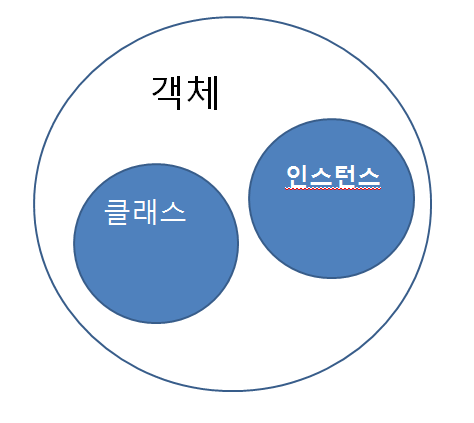

## 객체(Object)
- 소프트웨어 세계에서 구현할 대상.
- 속성과 기능을 갖춘 것.

## 클래스(Class)
- 객체를 만들어 내기 위한 설계도, 틀.
- 속성과 기능을 정의한 것.
- 연관된 변수와 메서드의 집합.

## 인스턴스(Instance)
- 속성과 기능을 가진 것 중 실제하는 것.
  - 설계도를 바탕으로 구현. 즉 객체를 실체화 한 것.
  - 실체화된 인스턴스는 메모리에 할당된다.

자동차를 예로 위의 정의를 다시 한 번 생각해보자.
속성과 기능을 갖춘 자동차는 `객체`라고 할 수 있다. 그리고 자동차는 여러 기능과 속성(속도, 기름양, 마력 등)을 가지고 있다. 이런 기능과 속성을 만들기 위해서는 설계도가 필요한데 이것을 `클래스`라고 한다. 이제 공장에서 이러한 기능, 속성을 바탕으로 자동차를 생산하는데 이렇게 생산 완료된 자동차를 `인스턴스`라고 한다.

### 참조
> [gmlwjd9405.github.io](https://gmlwjd9405.github.io/2018/09/17/class-object-instance.html)
