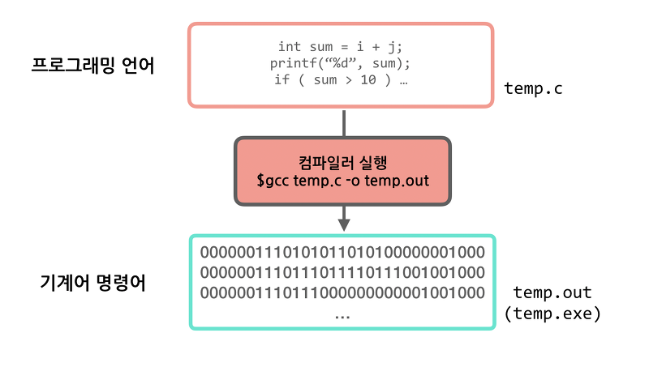
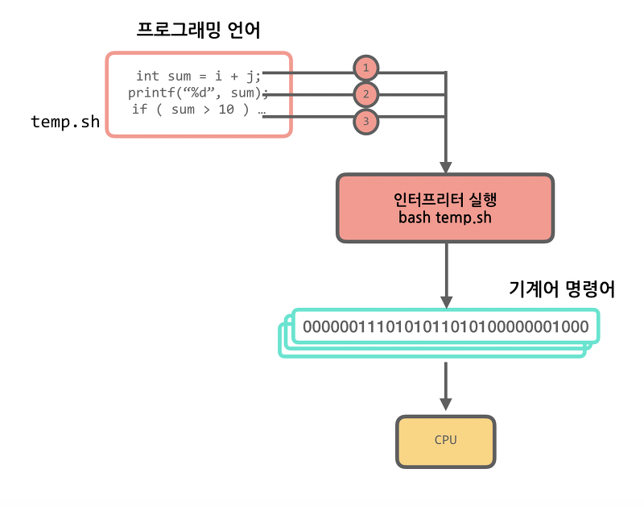
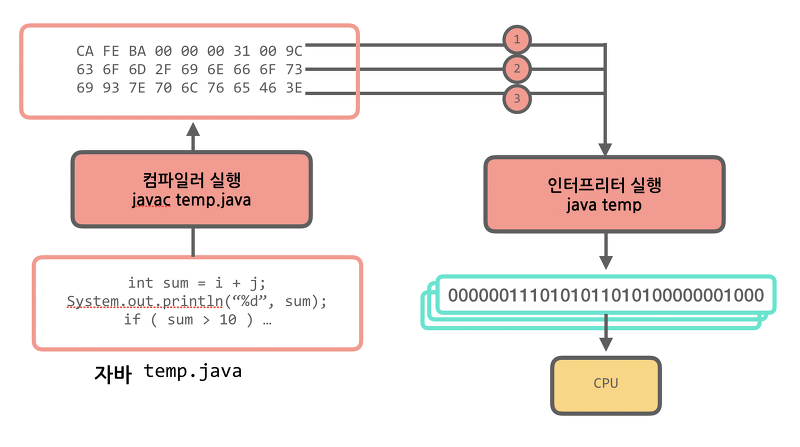

컴퓨터는 이진수만 이해한다는 사실은 많이 알려져 있을 것이다. 즉 컴퓨터는 우리가 사용하는 언어가 아닌 1, 0만을 이해한다는 뜻이다. 그렇다면 도대체 우리가 작성한 영문으로 된 프로그램을 어떻게 컴퓨터가 실행하는 것일까? 모든 프로그래밍언어는 그 프로그래밍 언어를 기계어 명령어로 번역 해 줄 번역기가 존재한다. 그리고 그 번역기가 영문으로 된 프로그래밍 언어(이런 사람이 이해하기 쉬운 언어를 고급언어라고 부른다)를 기계어 명령어로 번역해준다.

처음 프로그래밍 언어를 배울 때 환경 설정을 한다. 예를들어 자바라면 JDK를 설치하고, 파이썬이라면 파이썬을 설치하고, C라면 gcc와 같은 프로그램을 설치한다. 설치했던 바로 그 개발환경설정 툴 중에 이 번역기가 반드시 포함되어 있다. 번역기는 번역 시기에 따라 크게 `컴파일러(compiler)`와 `인터프리터(interpreter)`로 구분된다.

## 컴파일러(Compiler)

한 언어에서 다른 언어로 번역하는 프로그램을 `컴파일러`라고 부른다. 컴파일러는 무조건 기계어로 번역 할 필요는 없다. 예를들어 자바 -> C언어로 번역하는 번역기도 컴파일러이다. 여기서은 고급언어에서 기계어로 번역하는 컴파일러에 대해 이야기 하겠다. 컴파일러를 실행시키면 보통 번역해야 할 언어의 파일들과 번역 결과를 저장 할 파일의 이름을 받는다. 그리고 그 파일들을 모두 번역해서 하나의 바이너리(또는 어셈블리)파일로 저장한다. 그러면 이후에 사용자가 이 바이너리 파일을 실행시키면 프로그램이 실행되는 것이다.

대표적으로 C/C++ 와 같은 언어들을 들 수 있으며, Java 역시 바이트 코드로 바꾸기 위한 과정에서 컴파일을 수행한다.

#### 컴파일러의 장점
바이너리를 실행시키는 것이기 때문에 실행속도가 인터프리터에 비해 빠르다.

#### 컴파일러의 단점
컴퓨터 마다 컴파일을 해 줘야 한다. 즉, OS 환경에 맞게 호환되는 빌드환경을 구분해서 구축해줘야 한다.(e.g, x86과 x64를 구분해서 다운)

## 인터프리터(Interpreter)

인터프리터는 번역해야 할 파일을 받아 한 줄씩 실행시킨다. 예를들어 배시 인터프리터를 실행시키면 배시 인터프리터가 해당 파일의 첫번째 줄을 읽어 기계어 명령어로 번역 한 후 CPU에 바로 돌린다.

대표적으로 Javascript, PHP 등이 이에 해당된다. 인터프리터가 번역해야하는 프로그래밍 언어를 `스크립팅 언어`라고 부른다. 하지만, 스크립트 언어 뿐 아니라 컴파일 이후의 동작에서 인터프리터를 수행하는 언어들도 존재한다.

#### 인터프리터의 장점
인터프리터만 설치되어 있으면 같은 프로그램(스크립트)을 다른 컴퓨터에서도 실행 시킬 수 있다.

#### 인터프리터의 단점
각 행마다 번역 및 실행을 거쳐야 한다. 따라서, 컴파일된 프로그램에 비해 속도가 느리다.

## 하이브리드(Compiler-Interpreter-Compiler)
많은 프로그래밍 언어들의 인터프리터는 해석을 위한 Virtual Machine 을 두고, Machine 위에서 인터프리터를 수행하게 되는데, 이 때 해석의 기반이 되는 머신들이 OS 환경들을 지원해줌으로써, 해당 방식으로 인터프리터는 OS 및 플랫폼 에 종속되지않는 프로그램 구동이 가능하게 된다.

대표적인 하이브리드 형태로 작동하는 언어로는 자바가 있으며 JVM을 사용하여 프로그램을 돌린다.

JVM에 대해 자세히 알고 싶다면 이 글을 참고하길 바란다. [JVM이란?](https://hanul-dev.netlify.com/java/%EC%9E%90%EB%B0%94%EA%B0%80%EB%A8%B8%EC%8B%A0(jvm)%EC%9D%B4%EB%9E%80-%EB%AC%B4%EC%97%87%EC%9D%B8%EA%B0%80/)

temp.java는 컴파일시 temp.class라는 파일로 컴파일된다. 자바 컴파일러는 java를 16진수로 된 바이트코드(bytecode)라는 class파일로 컴파일한다. 그리고 자바 인터프리터가 자바를 실행 시 이 바이트코드를 한 줄씩 기계어로 번역해 CPU에 실행시킨다. 이 인터프리터는 JVM의 일부로 동작한다. 또 자바는 인터프리터의 단적을 극복하기 위해 JIT(Just-in-Time)컴파일러라는 것을 사용해 자주 사용되는 바이트코드를 기계어로 컴파일 해 사용한다. 이 점이 바로 자바를 하이브리드로 만든다.

### 참조
> [삐멜 소프트웨어](https://imasoftwareengineer.tistory.com/43?category=768151)

> [Jins' Dev](https://jins-dev.tistory.com/entry/Compiler-%EC%99%80-Interpreter-%EC%9D%98-%EA%B0%9C%EB%85%90%EA%B3%BC-%EC%B0%A8%EC%9D%B4%EC%A0%90)
