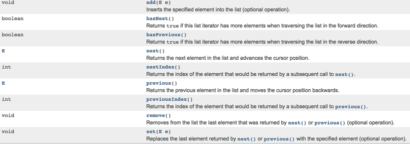

ListIterator 인터페이스는 Iterator 인터페이스를 상속받아 여러 기능을 추가한 인터페이스이다. 그리고 Iterator와 달리 컬렉션의 요소에 접근할 때 순방향, 역방향으로 이동할 수 있다.




```java
        LinkedList<Integer> list = new LinkedList<>();
        for (int i = 0; i < 10; i++) {
            list.add(i);
        }
```

```java
        ListIterator<Integer> listIterator = list.listIterator(list.size());
        while (listIterator.hasPrevious()) {
            System.out.print(listIterator.previous());
        }
        System.out.println();

        listIterator = list.listIterator();
        while (listIterator.hasNext()) {
            System.out.print(listIterator.next());
        }
```

```
9876543210
0123456789
```